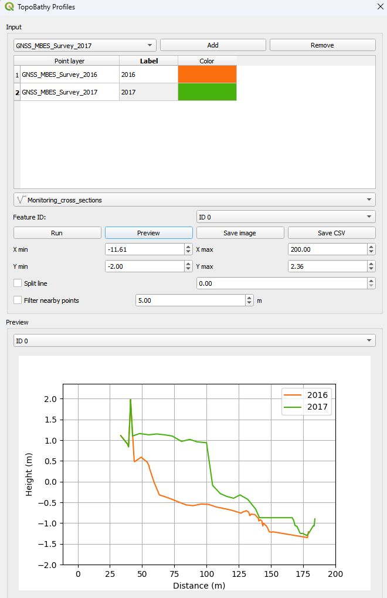

# TopoBathy Profiles

**TopoBathy Profiles** is a QGIS plugin for creating topo-bathymetric profiles from point layers along selected cross-section lines. The plugin allows you to preview, customize, and export profiles as graphs and CSV files.

## Features
- Add multiple point layers and assign labels and colors.
- Select a line layer to define cross sections.
- Filter points that are too close to each other.
- Automatically split lines based on distance criteria.
- Preview profiles directly within the plugin.
- Export profiles as high-resolution images (PNG) and CSV files.

---

## Installation
1. Download or clone this repository.
2. Copy the `topobathy_profiles` folder into your QGIS plugin directory:
   - **Windows:**  
     `C:\Users\<YourUsername>\AppData\Roaming\QGIS\QGIS3\profiles\default\python\plugins\`
   - **Linux:**  
     `~/.local/share/QGIS/QGIS3/profiles/default/python/plugins/`
   - **macOS:**  
     `~/Library/Application Support/QGIS/QGIS3/profiles/default/python/plugins/`
3. Open QGIS.
4. Go to **Plugins → Manage and Install Plugins**.
5. Enable **TopoBathy Profiles**.

---

## Usage
1. Add your point layers using the **Add** button.
2. Assign labels and colors in the table.
3. Select a cross-section line layer and choose a feature.
4. Set options such as **Split line** and **Filter nearby points**, if needed.
5. Click **Run** to generate profiles.
6. Preview the profiles in the preview window.
7. Export the profiles using **Save image** or **Save CSV**.

### Plugin interface

---

## Requirements
- QGIS 3.22 or higher
- Python 3
- PyQt5 (included with QGIS)
- NumPy
- Matplotlib

---

## License
This plugin is licensed under the MIT License. See the `LICENSE` file for details.

---

## Author
Enrica Vecchi  
Email: enrica.vecchi@unica.it  
GitHub: [https://github.com/evecchi/topobathy_profiles](https://github.com/evecchi/topobathy_profiles)
